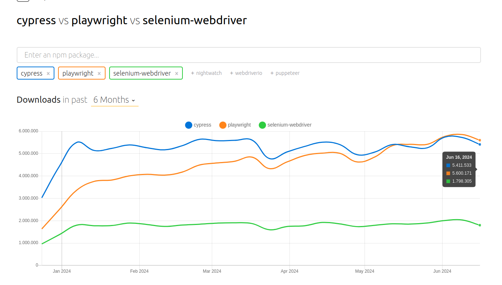
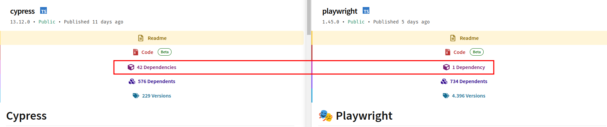
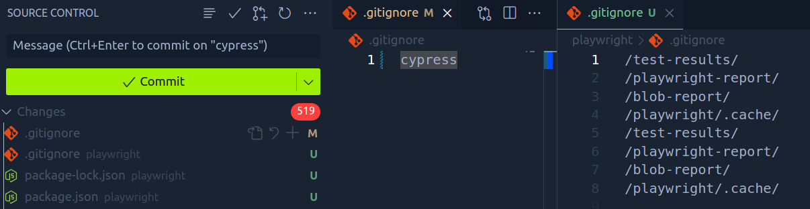
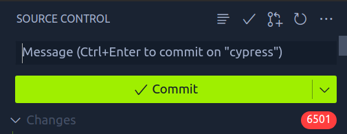

# Prova de Conceito entre Cypress e Playwright

É importante ressaltar que não existe um framework melhor ou pior, mas sim aquele que atende melhor às necessidades da empresa ou do time. Ambos os frameworks são amplamente procurados pelas empresas, como evidenciado pela quantidade de downloads de ambos. Sem dúvida, eles se destacam por serem os mais completos do mercado. Veja esse gráfico atualizado de quantidade de donwloads entre Cypress, Playwright e Selenium.

## **Cypress**

O Cypress é um framework para testes **e2e** que rapidamente ganhou destaque após seu lançamento. Diferentemente de seu principal concorrente na época, o Selenium, o Cypress oferece uma curva de aprendizado menor por utilizar JavaScript e ser escrito em Node.js, o que colaborou para o crescimento rápido do framework. O Cypress também resolve muitos problemas relacionados à configuração de ambiente e facilidade de escrita dos testes. A primeira versão do Cypress foi lançada há 9 anos (2015) e foi oficialmente lançada em 2018.

## **Playwright**

O Playwright é uma ferramenta de teste e automação de navegador desenvolvida pela Microsoft, que suporta múltiplos navegadores e oferece funcionalidades avançadas. Desde seu lançamento, tem ganhado espaço e hoje ultrapassou o Cypress em quantidade de downloads. Grande parte do interesse pelo Playwright se deve ao fato de ser um produto da Microsoft, o que gerou confiança no produto devido à possibilidade de um maior suporte. Sua primeira versão foi lançada em 2017 e foi oficialmente lançada em 2020.

> *Para que essa POC seja mais eficiente, você pode instalar os dois frameworks e seguir algumas execuções que iremos fazer.*

## **Pré-requisitos:**

- [Node.js](https://nodejs.org/en/download/prebuilt-installer)

- [Faça um fork e clone o repositório](https://github.com/WillamesVital/POC-Cypress-Playwright)

## **Instalação do Cypress:**

1. `npm init -y`
2. `npm install cypress --save-dev`
3. `npx cypress open`

## **Instalação do Playwright:**

1. `npm init playwright@latest`
2. Confirme as escolhas
3. Execute os testes: `npx playwright test`

## Comparações

Existem muitos trade-offs entre os dois frameworks.

### 1. Instalação

**Playwright** - Um comando e a estrutura básica para iniciar a escrita de testes está pronta.

**Cypress** - Três comandos e a estrutura básica para iniciar a escrita de testes está pronta.

### 2. Dependências

**Playwright** - Poucas dependências.

**Cypress** - Muitas dependências.

Como pode ser comparado no site do npmjs:

Isso também é perceptível no código:

**Playwright:**

**Cypress:**

